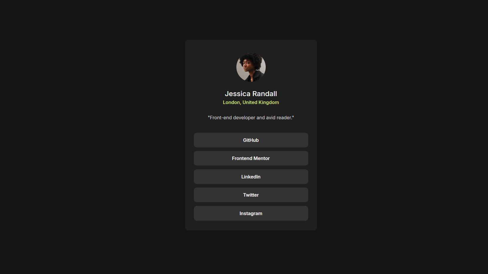

# Frontend Mentor - Social links profile solution

This is a solution to the [Social links profile challenge on Frontend Mentor](https://www.frontendmentor.io/challenges/social-links-profile-UG32l9m6dQ). Frontend Mentor challenges help you improve your coding skills by building realistic projects.

## Table of contents

-  [Overview](#overview)
   -  [The challenge](#the-challenge)
   -  [Screenshot](#screenshot)
   -  [Links](#links)
-  [My process](#my-process)
   -  [Built with](#built-with)
   -  [What I learned](#what-i-learned)
   -  [Continued development](#continued-development)
   -  [Useful resources](#useful-resources)
-  [Author](#author)

## Overview

### The challenge

Users should be able to:

-  See hover and focus states for all interactive elements on the page

### Screenshot

### Links

-  Solution URL: [Add solution URL here](https://github.com/Rengrouze/social-links-profile-main)
-  Live Site URL: [Add live site URL here](https://rengrouze.github.io/social-links-profile-main/)

## My process

### Built with

-  Semantic HTML5 markup
-  CSS custom properties
-  Flexbox

### What I learned

that was a good reminder of basic animation for changing colors

### Continued development

it could benefits for some emoji but it is more design oriented than dev work

### Useful resources

-  [CSS animation](https://www.w3schools.com/css/css3_animations.asp) - could be useful if you forgot how keyframes work

## Author

-  Website - [Rengrouze](https://github.com/Rengrouze)
-  Frontend Mentor - [@Rengrouze](https://www.frontendmentor.io/profile/Rengrouze)
